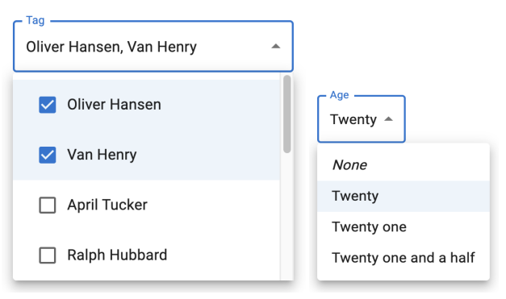
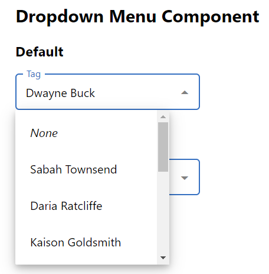
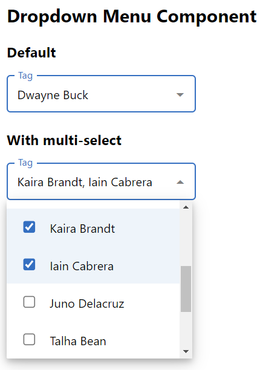

# Dropdown menu component

By William Décoste \
<widec@me.com>

## Requirements (design to reproduce)

## Solution

## Available Scripts

In the project directory, you can run:

### `npm install`

Installs the dependencies to the local node_modules folder.

### `npm start`

Runs the app in the development mode.\
Open [http://localhost:3000](http://localhost:3000) to view it in your browser.
